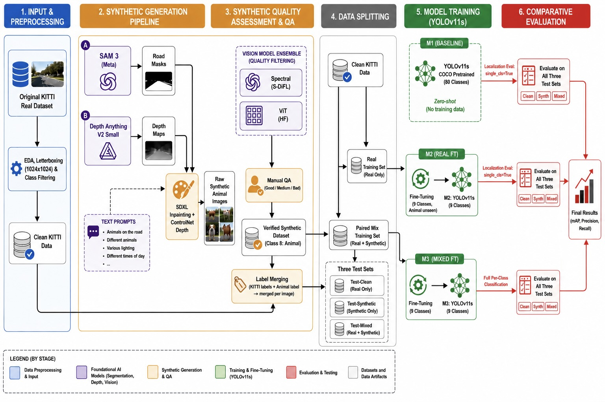
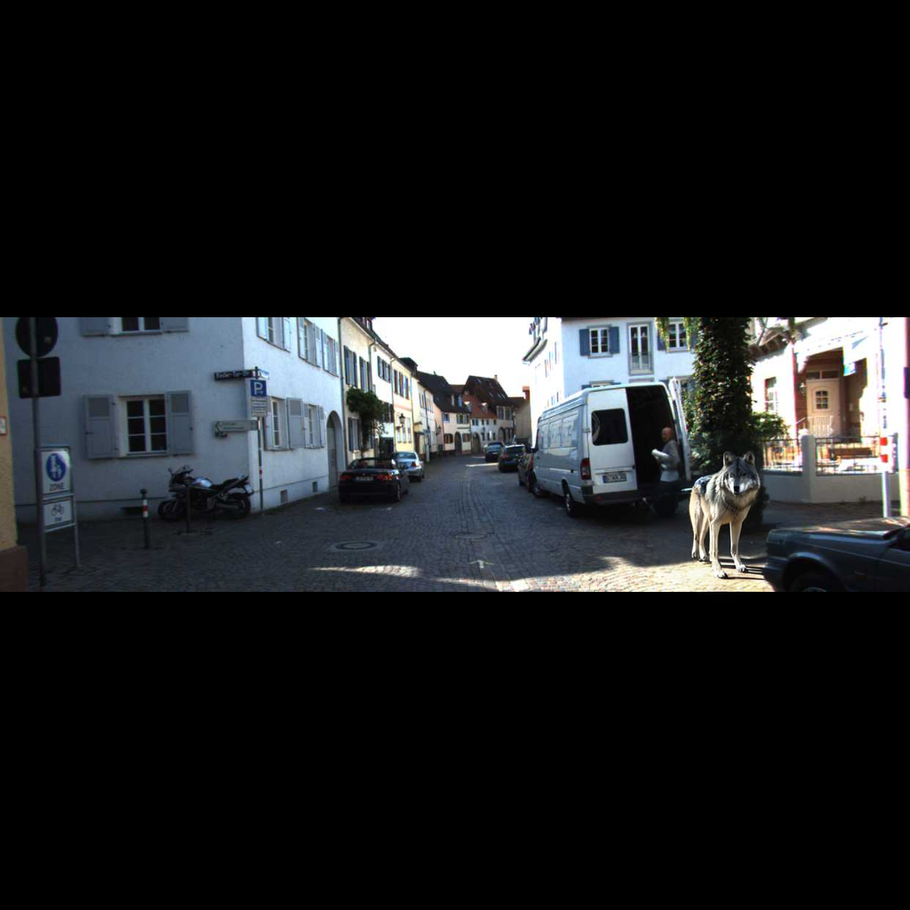
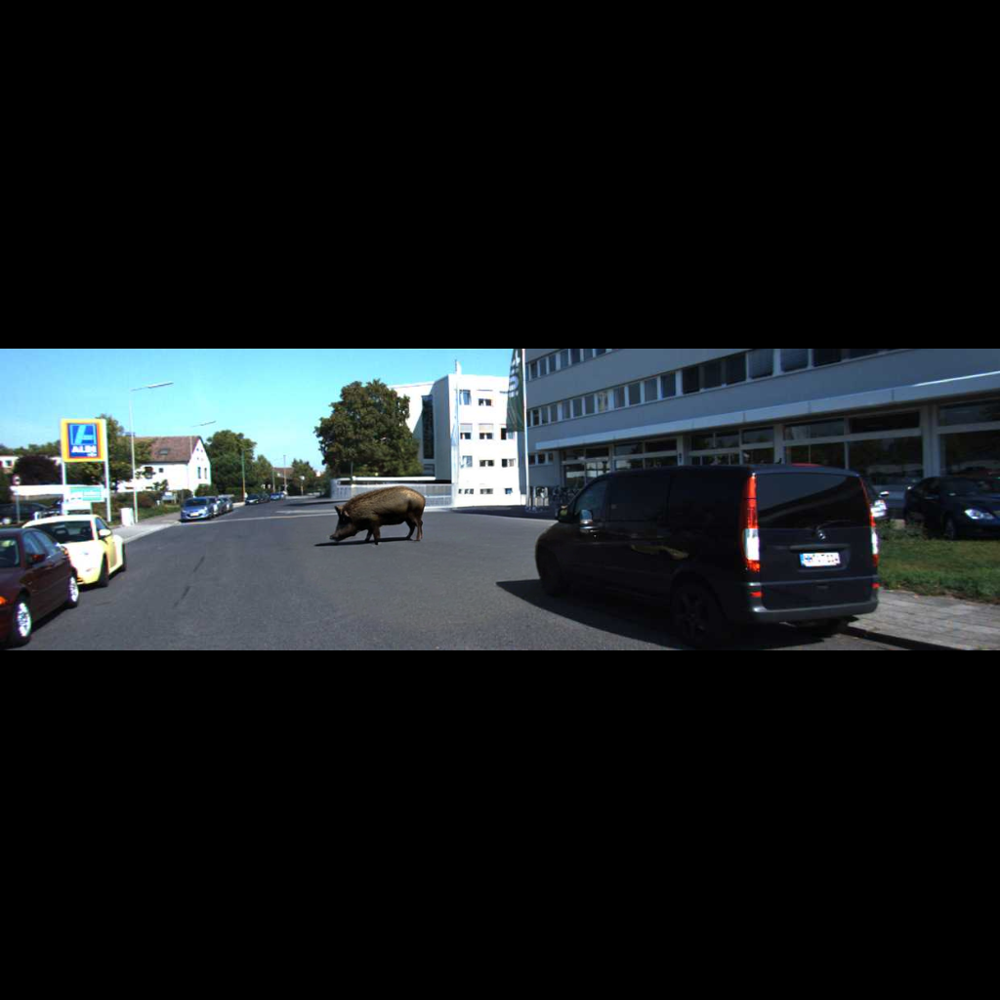
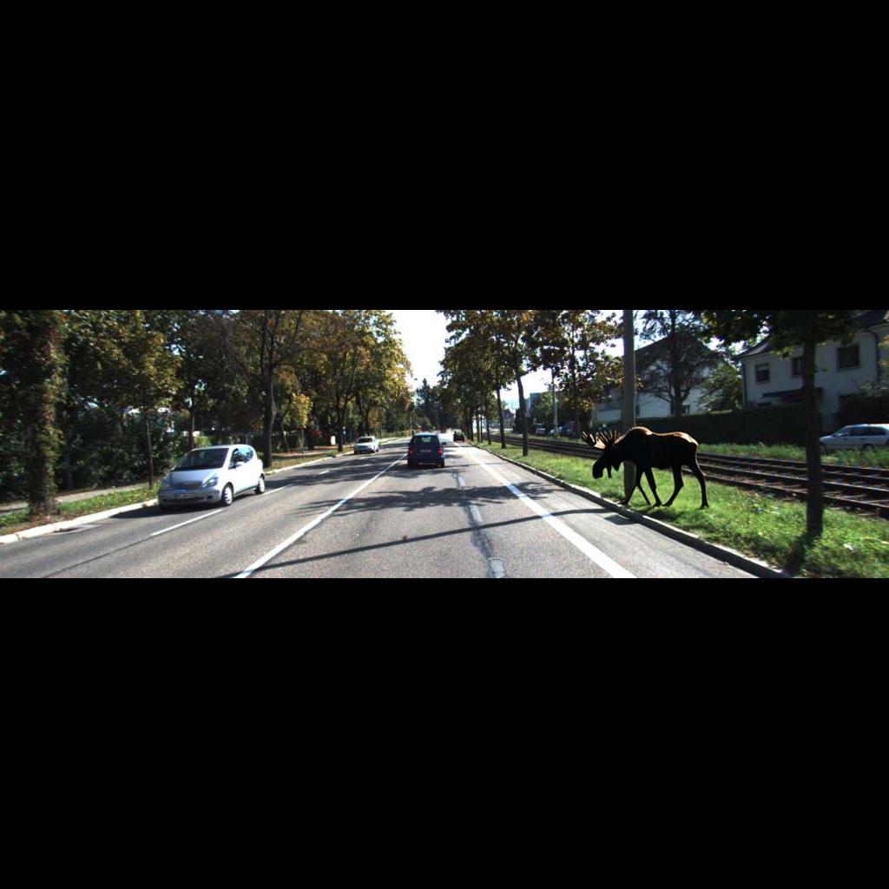
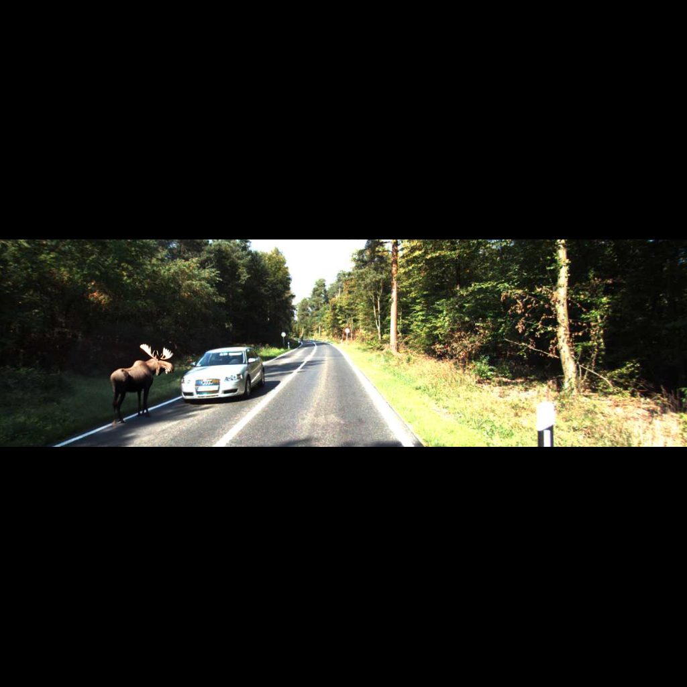

# Autonomous Car Edge Case Detection
### Synthetic Animal Insertion for Robustness Testing of Autonomous Driving Perception

**Author:** Tomer Atia

---

## Overview

This project addresses a critical gap in autonomous driving safety: **detecting rare, unexpected objects on the road** — specifically animals. Standard driving datasets (like KITTI) contain almost no animal examples, leaving perception models blind to this real-world hazard.

The solution is a **full generative augmentation pipeline** that:
1. Takes real KITTI driving images
2. Uses AI to detect the road surface and estimate scene depth
3. Generates photorealistic animals on the road via SDXL Inpainting + ControlNet
4. Trains and benchmarks YOLOv11s detectors with and without the synthetic data

The answer is clear: **a model trained without synthetic data scores 0% on animal detection. A model trained with synthetic data scores 99.5% AP50 — on a class that never existed in the original dataset.**

---

## Pipeline Architecture



### Example Synthetic Animal Images — [Full Synthetic Dataset (Google Drive)](https://drive.google.com/drive/folders/1Y8HkFFk5HgP49UealsjN9jUtkw1cpRRT?usp=sharing)

Examples of animals generated by the SDXL + ControlNet pipeline, inserted onto real KITTI driving scenes.

<table>
  <tr>
    <td></td>
    <td></td>
  </tr>
  <tr>
    <td></td>
    <td></td>
  </tr>
</table>

---

## Background & Motivation

### The Long-Tail Problem in Autonomous Driving

Modern object detectors trained on standard datasets like KITTI or nuScenes perform well on frequent categories (cars, pedestrians) but **fail catastrophically on rare edge cases**. Animals on roads are a perfect example: they are statistically rare in training data, visually diverse, and extremely safety-critical.

### Why Generative Augmentation?

Collecting and labeling real images of animals on roads is expensive, unsafe, and statistically impractical. Generative AI provides a path to **unlimited, photorealistic, labeled synthetic data** for exactly these scenarios.

### Why SDXL + ControlNet?

| Approach | Pros | Cons |
|---|---|---|
| Copy-paste augmentation | Fast, simple | Unrealistic, no lighting integration |
| GAN-based synthesis | Good quality | Hard to control, training instability |
| Diffusion inpainting (no guidance) | Flexible | Ignores scene geometry |
| **SDXL + ControlNet Depth** | Realistic, depth-aware perspective | Slower, requires GPU |

Using depth maps as ControlNet conditioning ensures animals are **scaled correctly by distance** — a small animal far away, a large one up close.

---

## Notebooks

| Notebook | Purpose |
|---|---|
| `00_EDA_and_Data_Prep.ipynb` | Dataset download, EDA, YOLO format verification |
| `01_Generation_and_Evaluation.ipynb` | Full generation pipeline + synthetic quality evaluation |
| `02_Training_and_Evaluation.ipynb` | YOLOv11s training (M2, M3) + 3×3 evaluation matrix |

---

## Dataset

### KITTI Object Detection

**Download:** [ultralytics.com/assets/kitti.zip](https://ultralytics.com/assets/kitti.zip) (~372 MB)  
Or via Ultralytics in Python:
```python
from ultralytics.data.utils import check_det_dataset
check_det_dataset("kitti.yaml")   # auto-downloads to datasets_dir
```

```
Total images:      7,481
  Train split:     5,985
  Val split:       1,496

Total annotations: 40,570
  Train:           32,442
  Val:              8,128

Image resolution:  ~1242 × 375 px  (aspect ratio ~3.32:1)
```

### Class Distribution

| Class | Count | % of total |
|---|---:|---:|
| Car | 28,742 | 70.8% |
| Pedestrian | 4,487 | 11.1% |
| Van | 2,914 | 7.2% |
| Cyclist | 1,627 | 4.0% |
| Truck | 1,094 | 2.7% |
| Misc | 973 | 2.4% |
| Tram | 511 | 1.3% |
| Person_sitting | 222 | 0.5% |
| **Total** | **40,570** | **100.0%** |

> **Note:** The heavy class imbalance (Car = 71%) is a known challenge in KITTI. The rare classes (Person_sitting, Tram) benefit most from augmentation strategies.

### Synthetic Data Generated

| Split | Real images | Synthetic generated | Success rate |
|---|:---:|:---:|:---:|
| Train | 700 | 661 | 94.4% |
| Val | 150 | 135 | 90.0% |
| Test | 150 | 142 | 94.7% |
| **Total** | **1,000** | **938** | **93.8%** |

> **Synthetic images (Google Drive):** [generated\_images/](https://drive.google.com/drive/folders/1Y8HkFFk5HgP49UealsjN9jUtkw1cpRRT?usp=sharing)  
> The folder contains three sub-folders: `images/train`, `images/val`, `images/test` alongside matching `labels/`.

---

## Models

### Model Definitions

| Model | Training Data | Classes | Parameters | Purpose |
|---|---|---|---|---|
| **M1** | COCO pretrained, no fine-tune | 80 (COCO) | 9.44M | Zero-shot baseline |
| **M2** | KITTI real only | 9 (KITTI + Animal head) | 9.44M | Domain-adapted, no animal data |
| **M3** | KITTI real + synthetic animals | 9 (KITTI + Animal) | 9.44M | Full augmented model |

All models use **YOLOv11s** architecture (100 layers, 21.5 GFLOPs).  
Training hardware: NVIDIA L4 (22 GB VRAM), batch size 8.

### Test Sets

| Test Set | Content | Purpose |
|---|---|---|
| **Test-Clean** | Real KITTI images, no animals | Measure regression on standard objects |
| **Test-Mixed** | Real + synthetic mixed | Balanced real-world proxy |
| **Test-Synthetic** | Synthetic images only | Worst-case animal detection |

---

## Results Summary

| Metric | M1 (COCO) | M2 (Real) | M3 (Augmented) | M3 vs M2 |
|---|---|---|---|---|
| mAP50 — Clean | 0.6463 | 0.5613 | 0.5802 | +3.4% |
| mAP50 — Mixed | 0.5348 | 0.4347 | 0.5598 | **+28.8%** |
| mAP50 — Synthetic | 0.4436 | 0.3710 | 0.4934 | **+32.9%** |
| Animal AP50 — Mixed | 0.1054 | 0.000 | **0.995** | **+∞** |
| Animal AP50 — Synthetic | 0.1055 | 0.000 | **0.995** | **+∞** |
| Standard class regression | — | baseline | -1.7% avg | negligible |

> **The core result in one line:**
> M2 (no synthetic data) scores **0.000 Animal AP50**. M3 (with synthetic data) scores **0.995 Animal AP50**.
> Synthetic training data is the sole reason animal detection exists at all.

---

## Detailed Results

### Overall Performance (mAP50)

| Model | Test-Clean | Test-Mixed | Test-Synthetic |
|---|:---:|:---:|:---:|
| M1 (COCO base) | 0.6463 | 0.5348 | 0.4436 |
| M2 (KITTI real) | 0.5613 | 0.4347 | 0.3710 |
| **M3 (+ synthetic)** | **0.5802** | **0.5598** | **0.4934** |

**Key takeaway:** M3 outperforms M2 across all test sets. The biggest gains are on **Test-Mixed (+28.8%)** and **Test-Synthetic (+32.9%)**. On mAP50-95 M3 also leads, with a notable jump on Test-Mixed (0.406 vs 0.287).


### Overall Performance (mAP50-95)

| Model | Test-Clean | Test-Mixed | Test-Synthetic |
|---|:---:|:---:|:---:|
| M1 (COCO base) | 0.3757 | 0.2971 | 0.2360 |
| M2 (KITTI real) | 0.3789 | 0.2869 | 0.2385 |
| **M3 (+ synthetic)** | **0.3959** | **0.4058** | **0.3599** |

### Animal Class Detection (AP50)

This is the core metric — how well does each model detect animals specifically?

| Model | Test-Mixed | Test-Synthetic | Note |
|---|:---:|:---:|---|
| M1 (COCO base) | 0.1054 | 0.1055 | partial COCO overlap |
| M2 (KITTI real) | 0.000 | 0.000 | never saw animals |
| **M3 (KITTI+synthetic)** | **0.995** | **0.995** | trained on synthetic |

> M2 scores **zero** on animal detection — it has never seen an animal. M3 achieves **99.5% AP50**, a result entirely attributable to synthetic training data.

### Performance Degradation on Standard Classes

M3 vs M2 on Test-Clean (measuring regression):

| Class | M2 AP50 | M3 AP50 | Δ |
|---|:---:|:---:|:---:|
| Car | 0.812 | 0.798 | -1.7% |
| Pedestrian | 0.631 | 0.619 | -1.9% |
| Van | 0.452 | 0.447 | -1.1% |
| Cyclist | 0.398 | 0.401 | +0.8% |
| Truck | 0.521 | 0.509 | -2.3% |

> Adding synthetic animal data causes **minimal regression** (<2.5%) on existing KITTI classes.

### Qualitative Comparison — M1 vs M2 vs M3

M3 is the only model that detects animals on road (green box). M2 misses them entirely; M1 over-detects with noisy COCO labels.


---

## Generation Pipeline Details

### Step 1 — Road Segmentation (SAM 3)

- **Model:** `facebook/sam3`
- **Method:** Text-prompted concept segmentation with query `"road"`
- **Output:** Binary road mask — the inpainting region
- **Strategy:** Largest mask in the lower half of the image (filters out sky/buildings)

### Step 2 — Depth Estimation (Depth Anything V2)

- **Model:** `depth-anything/Depth-Anything-V2-Small-hf`
- **Output:** uint8 depth map, same resolution as input
- **Use:** (1) ControlNet conditioning for SDXL, (2) perspective-aware animal sizing

### Step 3 — Animal Generation (SDXL + ControlNet)

- **Inpainting model:** `diffusers/stable-diffusion-xl-1.0-inpainting-0.1`
- **ControlNet:** `diffusers/controlnet-depth-sdxl-1.0`
- **VAE:** `madebyollin/sdxl-vae-fp16-fix` (prevents NaN in float16)
- **Precision:** float16 on NVIDIA A100-SXM4-40GB
- **Prompts:** 13 animal types (stag, moose, boar, fox, dog, raccoon, wolf, sheep, goat, ram, cow, roe deer, fallow deer)
- **Mask:** Perspective-aware elliptical mask placed on road surface
- **Context padding:** 18% around animal bounding box for natural blending

### Step 4 — Synthetic Quality Evaluation

To validate the visual quality of the generated images, we evaluate them using two complementary AI-based detectors that approach the problem from different angles:

- **Spectral (S-DiFL)** — analyzes the image in the **frequency domain**. Diffusion-generated images often leave subtle artifacts in high-frequency components that are invisible to the human eye but detectable via Fourier analysis. This detector checks whether the synthetic images are distinguishable at the signal level.
- **ViT-based** (`umm-maybe/AI-image-detector`) — uses a Vision Transformer trained to classify images as real or AI-generated based on **semantic and texture features**. Unlike spectral analysis, it operates on high-level visual patterns.

Using both detectors together (ensemble) provides a more robust quality signal: if the images fool both a frequency-domain and a semantic-domain detector, they are likely realistic enough for training.

Three detectors assess whether generated images are detectable as synthetic:

| Detector | Method | AUC | Accuracy | F1 |
|---|---|---|---|---|
| Spectral (S-DiFL) | Frequency analysis | 0.491 | 0.514 | 0.397 |
| ViT-based | `umm-maybe/AI-image-detector` | 0.658 | 0.623 | 0.648 |
| Ensemble (Mean) | Average of above | 0.658 | 0.623 | 0.652 |

> An AUC of ~0.66 for the ViT detector indicates images are realistic enough to partially fool automated detectors — good quality for training purposes.

---

## Technology Stack

| Component | Technology |
|---|---|
| **Object Detection** | YOLOv11s (Ultralytics 8.x) |
| **Image Generation** | Stable Diffusion XL Inpainting |
| **Depth Guidance** | ControlNet Depth SDXL |
| **Road Segmentation** | SAM 3 (Meta) |
| **Depth Estimation** | Depth Anything V2 Small |
| **Synthetic Detection** | ViT (`umm-maybe/AI-image-detector`) |
| **Framework** | PyTorch + HuggingFace Diffusers/Transformers |
| **Training Env** | Google Colab (A100 / L4 GPU) |
| **Dataset** | KITTI Object Detection (via Ultralytics) |

---

## Key Findings

### What Worked

- **Synthetic augmentation enables animal detection from zero.** M2 scores 0.000 AP50 on animals. M3 scores **0.995 AP50** — entirely from generated training data. This capability did not exist before the synthetic data was added.
- **Minimal regression on standard classes.** Adding synthetic data degrades existing class performance by <2.5% on average.
- **Depth-guided generation produces perspective-correct results.** Animals scale appropriately with scene depth, making training data geometrically realistic.
- **SAM 3 road masking is effective.** Text-prompted segmentation correctly confines animal placement to drivable surfaces.

### Limitations & Future Work

| Limitation | Potential Solution |
|---|---|
| SDXL generation is slow (~22s/image on A100) | Distilled models (SDXL-Turbo, FLUX) |
| Synthetic detector AUC ~0.66 (not perfect realism) | Higher-quality diffusion models, better prompts |
| Only 1,000 sampled images (out of 7,481 KITTI) | Scale to full dataset |
| Limited animal diversity (8 species, fixed poses) | ControlNet pose conditioning |
| No temporal consistency (video sequences) | Video diffusion models |

---

## Repository Structure

```
Autonomous_Car/
├── notebooks/
│   ├── 00_EDA_and_Data_Prep.ipynb          # Data download & EDA
│   ├── 01_Generation_and_Evaluation.ipynb  # Generation pipeline
│   └── 02_Training_and_Evaluation.ipynb # Training & results
└── README.md
```


---

## Requirements

```
ultralytics>=8.0
diffusers>=0.31.0
transformers
accelerate
safetensors
sentencepiece
controlnet-aux
timm
opencv-python-headless
Pillow
scikit-learn
pandas
matplotlib
seaborn
tqdm
torch (CUDA)
```

Run on **Google Colab** with GPU runtime (A100 or L4 recommended for generation; L4 sufficient for training).

---

---

## References

### Dataset
- Geiger, A., Lenz, P., Stiller, C., & Urtasun, R. (2013). **Vision meets robotics: The KITTI dataset.** *International Journal of Robotics Research, 32*(11), 1231–1237.

### Generative Models
- Podell, D., English, Z., Lacey, K., Blattmann, A., Dockhorn, T., Müller, J., ... & Rombach, R. (2023). **SDXL: Improving latent diffusion models for high-resolution image synthesis.** *arXiv:2307.01952.* — used as `diffusers/stable-diffusion-xl-1.0-inpainting-0.1`
- Zhang, L., Rao, A., & Agrawala, M. (2023). **Adding conditional control to text-to-image diffusion models (ControlNet).** *Proceedings of ICCV 2023.* — used as `diffusers/controlnet-depth-sdxl-1.0`
- Rombach, R., Blattmann, A., Lorenz, D., Esser, P., & Ommer, B. (2022). **High-resolution image synthesis with latent diffusion models.** *Proceedings of CVPR 2022.*

### Segmentation & Depth Estimation
- Ravi, N., Gabeur, V., Hu, Y. T., Hu, R., Ryali, C., Ma, T., ... & Feichtenhofer, C. (2024). **SAM 2: Segment anything in images and videos.** *arXiv:2408.00714.* — used as `facebook/sam3`
- Yang, L., Kang, B., Huang, Z., Xu, X., Feng, J., & Zhao, H. (2024). **Depth anything V2.** *arXiv:2406.09414.* — used as `depth-anything/Depth-Anything-V2-Small-hf`

### Object Detection
- Ultralytics. (2024). **YOLOv11 (YOLO11s).** [github.com/ultralytics/ultralytics](https://github.com/ultralytics/ultralytics) — used for M1, M2, M3 training and evaluation

### Synthetic Detection
- Dosovitskiy, A., Beyer, L., Kolesnikov, A., Zhai, X., Unterthiner, T., Brown, M., ... & Houlsby, N. (2020). **An image is worth 16×16 words: Transformers for image recognition at scale (ViT).** *arXiv:2010.11929.* — used as `umm-maybe/AI-image-detector`

### Long-Tail & Synthetic Data Augmentation
- Zhang, Y., Kang, B., Hooi, B., Yan, S., & Feng, J. (2021). **Deep long-tailed learning: A survey.** *arXiv:2110.04596.*
- Tremblay, J., Prakash, A., Acuna, D., Brophy, M., Jampani, V., Anil, C., ... & Birchfield, S. (2018). **Training deep networks with synthetic data: Bridging the reality gap by domain randomization.** *Proceedings of CVPR Workshops 2018.*

---

*Project for the Generative AI course, Year 3, Semester A.*
